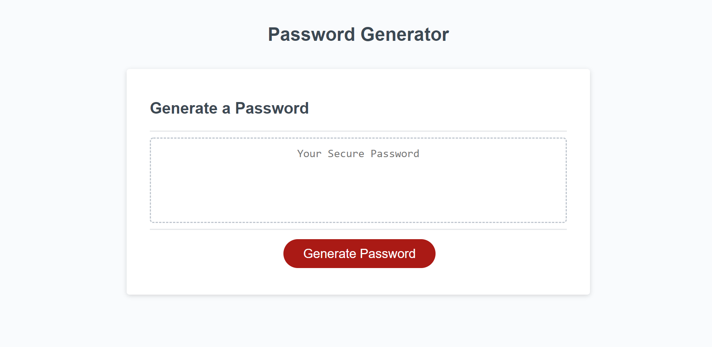

# Password Generator

## Description
This password generator spits out a password based on prompts asking the user to confirm what criteria they would like in their password.

## Challenges

My biggest challenge was putting the for loop together. With some assistance from the BCS they helped me realize I was missing an index variable. Once I added that, my password generated not only numbers but all the criteria.

Another challenge was with asking for the password length from the user. If the user doesn't put in any character number and leaves it empty, I tried to prompt the user that "" or null is not a valid input. I was unable to figure out how to correct this issue right away and will be working on figuring this out and re-sbumitting. 

I am taking steps to understand JavaScript better outside of class by taking free online courses in addition to reviewing the resources material provided by the TA's.

## Deployment Link
* Click [here](https://maggiejoe.github.io/password-generator/) to view my deployable link!
* Click [here](https://github.com/maggiejoe/password-generator.git) to view my github repo!

## Screenshot
Below is a screenshot of the beginning of my application

## Citation
I used the bootcamp module in addition to the robot gladiators program as a reference. 

I was intoduced to `concat` from an learning assistant with the BCS and he explained what it was and its uses.

# Challenge #3 Criteria

## Technical Acceptance

* :white_check_mark: Create a randomly generated password for greater password security
* :white_check_mark: When the generate password button is clicked, the user is presented with prompts for password criteria
* :white_check_mark: The user then has the ability to select the criteria
* :white_check_mark: Once password criteria is selected, a prompted is presented asking the user the length of the length of the password. The password length must be between 8 and 128 characters
* :white_check_mark: When character types are asked to be included in the password, the user has the ability click on whether or not to include the following:
    * lowercase
    * uppercase
    * numeric
    * special characters
* :white_check_mark: When the prompts are answered, the inputs should be validated and at least one character type is selected
* :white_check_mark: Following all prompts, a password is generated that matches the selected criteria and is displayed in an alert or written on the page

## Deployment

* :white_check_mark: Application Deploys @ live URL
* :white_check_mark: Application loads error free
* :white_check_mark: GitHub URL submitted
* :white_check_mark: GitHub repo contains application code

## Application Quality

* :white_check_mark: User experience is intuitive and easy to navigate
* :white_check_mark: UI style is clean and polished
* :white_check_mark: Application resembles the mock-up functionality provided in the instructions

## Repository Quality

*  :white_check_mark:Repo has unique name
* :white_check_mark: Repo follows best practices for file structure & naming conventions
* :white_check_mark: Repo follows best practices for class/id naming, indentation, quality comments...etc
* :white_check_mark: Repo has multiple commit messages
* :white_check_mark: Repo has quality README file with descriptions, screenshots & a link to deploy application